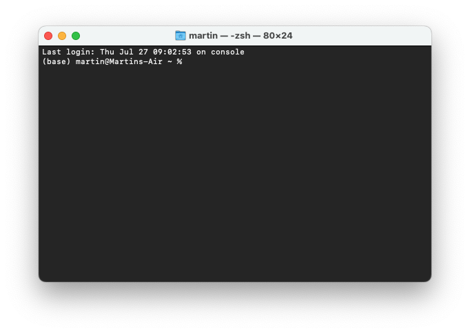
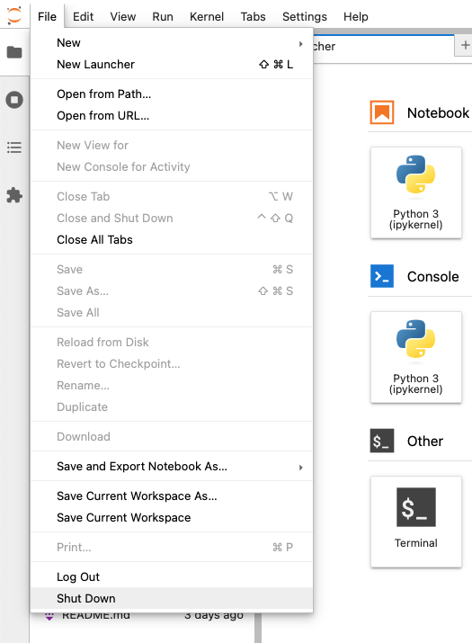

The course does not use any university-specific resources. It is designed to run entirely
on students' machines using solely open-source software.

## Communication

Students enrolled in the course at Charles University will be using a dedicated
[[Moodle course](https://dl2.cuni.cz/course/view.php?id=6455) for submissions and information sharing]{.content-visible when-profile='sds4sg'}[Microsoft Teams team facilitating both asynchronous discussion and synchronous teaching]{.content-visible when-profile='micro'}.

## Code management and submissions

The course will be using materials gradually released at this website. In the beginning, the students are expected to download a folder and work locally within it. Part of the folder
will be a definition of the software stack.

## Software stack

There are many options on how to run Python. You may already have a copy on your machine,
you can run it in the browser and install it in a myriad ways. This course uses
what is considered a standard for **scientific** computing based on two key components -
a package manager (you will be using `Pixi`) and an interface (Jupyter Lab).

::: {.callout-note collapse="true"}
# Shell 101

Spatial Data Science depends on code, and coding environments can be unfriendly to
an average user. People designing the tools are often computer scientists or have a strong
knowledge of CS-related environments. It means we sometimes need to deal with tools
that look a bit scary, like a Terminal or a Powershell. Below is a brief introduction
to the tools you will need for this course.

### Terminal and Command line

Depending on your operating system, you will have either Terminal (macOS, Linux) or
Command Prompt application installed. It will look like this:



Terminal (and Powershell, but we will refer to all as the terminal for simplicity) is
used to interact with applications that do not have any graphic interface or with
the apps that do have one, but you want to use them programmatically. The terminal usage
is straightforward. Let's start with a few examples.

1. Create a folder (or maybe you already have) to store files for this course.
2. Download this notebook by clicking on the [Jupyter]{.keystroke} option on the right
   side of this page and move the notebook to the folder.

You want to see a list of files and folders you have in the folder. First, you need to navigate to
the folder. For that, you can use the `cd` command, which stands for [c]{.accent}hange
[d]{.accent}irectory.

```sh
cd courses/sds/
```

Let's assume that you have the folder with course material in the folder called `sds` in
another folder called `courses`. The full command is then composed of the `cd` part,
saying *set the current directory to...* and waits for the parameter, which is a path
to the folder in this case - `courses/sds/`.

Once in the correct folder, you can use another command, `ls`, which stands for [l]{.accent}i[s]{.accent}t
and allows you to list the contents of the current directory.

```sh
ls
```

The output would look like this:


You can also pass a parameter `-l`, specifying that you want a long listing including attributes.

```sh
ls -l
```

That changes the output to this:


The syntax is always the same, starting with the app name and then followed by parameters.

:::

### 1. Install Pixi

The main tool dealing with the setup of the coding environment used in this course is [Pixi](https://pixi.sh). Go to Pixi website, and follow the [installation instructions](https://pixi.sh/latest/#installation) to install it on your machines.

### 2. Get the folder and install the environment

Download the folder available at [https://martinfleischmann.net/sds/spatial-data-science.zip](https://martinfleischmann.net/sds/spatial-data-science.zip) and unzip at a preferred location. The folder contains
the definition of the environment.

1. Download the folder to a location on your machine where you'd like to store the files for this course.
2. Use Powershell (Windows) or Terminal (macOS, Linux) to navigate to the folder. Do this by typing `cd ` and dragging and dropping the folder to the shell window. Then hit [Enter]{.keystroke}.
4. Install the enviroment using `pixi install`.
5. Start the Jupyter Lab interface using `pixi run jupyter lab`.

That is all!

### Closing and reopening Jupyter Lab

The best way to close the Jupyter Lab and shut down its process running in the terminal is to use the Jupyter Lab's interface. In the menu find [File]{.keystroke} > [Shut Down]{.keystroke}.



Next time, navigate to the folder and run `pixi run jupyter lab` again.


::: {.callout-note collapse="true"}

### Create an environment with conda

If you prefer to use `conda` over `Pixi`, you can follow the instructions below.

::: {.callout-important}
# Anaconda and the other snakes

If you have Anaconda, conda, or mamba installed, use that directly. Just start `Anaconda Prompt` (or any other relevant prompt) or `Terminal` and start with the point _Create a Python environment_.
:::

::: {.panel-tabset group="os"}

### Windows

::: {.callout-caution}
Windows may complain that the app is not recognised. Click _More information_ and you will be able to run the installer.
:::

1. Download `miniconda` package manager from [Anaconda](https://docs.anaconda.com/miniconda/miniconda-install/){.external target="_blank"} for your operating system.
2. Execute the installer and make sure to create start menu shortcuts (there's a tick box during installation).
3. Open the installed `Anaconda Prompt` application.
4. Configure `conda` to avoid automatic activation of the base environment. You should never use it to avoid issues in the future.

```sh
conda config --set auto_activate_base false
```

5. Create a Python environment using the following command:

```sh
conda env create -f https://martinfleischmann.net/sds/environment.yml
```

6. Activate the environment using:

```sh
conda activate sds
```

7. Start JupyterLab interface:

```sh
jupyter lab
```

::: {.callout-important}
Ensure that you install `miniconda` in a directory without any special characters in the name. It may occasionally break things.
:::

### macOS & Linux

1. Download `miniconda` package manager from [Anaconda](https://docs.anaconda.com/miniconda/miniconda-install/){.external target="_blank"} for your operating system and install it.
2. Open `Terminal` application.
3. Configure `conda` to avoid automatic activation of the base environment. You should never use it to avoid issues in the future.

```sh
conda config --set auto_activate_base false
```

4. Create a Python environment using the following command:

```sh
conda env create -f https://martinfleischmann.net/sds/environment.yml
```

5. Activate the environment using:

```sh
conda activate sds
```

6. Start JupyterLab interface:

```sh
jupyter lab
```
:::

A Jupyter Lab interface will show up in your browser. If it hasn't opened automatically, copy the link printed in your command line/terminal.

### Closing Jupyter Lab

The best way to close the Jupyter Lab and shut down its process running in the terminal is to use the Jupyter Lab's interface. In the menu find [File]{.keystroke} > [Shut Down]{.keystroke}.


### Opening Jupyter Lab next time

The steps above are needed only the first time. Once you create the environment, it won't disappear and you can use it until you don't delete it. Once you close Jupyter Lab session, you can always start a new one:

::: {.panel-tabset group="os"}
### Windows

1. Open `Anaconda Prompt`
2. Activate the environment:

```sh
conda activate sds
```

3. Start JupyterLab interface:

```sh
jupyter lab
```

### macOS & Linux

1. Open `Terminal`
2. Activate the environment:

```sh
conda activate sds
```

3. Start JupyterLab interface:

```sh
jupyter lab
```

:::

::: {.callout-important}
# Always activate an environment

You should never use `conda install` in the base environment. Remember to always activate the environment.
:::

:::

### Plan B with Google Colab

If you are unable to install an environment using the instructions above, you can follow
the course using [Google Colab](https://colab.research.google.com). You will just need to install the required packages to
your Colab environment. Reach out if you need to set it up.

### Troubleshooting

In case of any issues related to environment creation, reach out in the class or via [[Moodle](https://dl2.cuni.cz/course/view.php?id=6455) forum]{.content-visible when-profile='sds4sg'}[Teams]{.content-visible when-profile='micro'}.