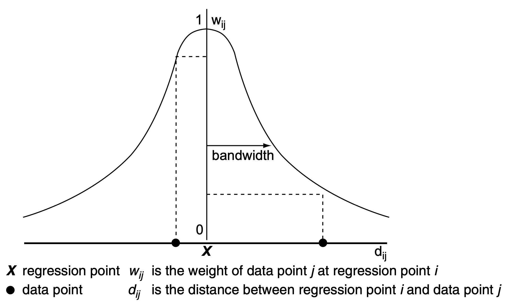
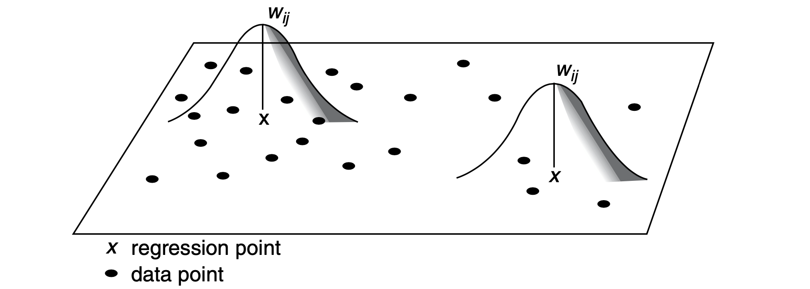

```{python}
# | echo: false
import warnings

warnings.filterwarnings("ignore", category=SyntaxWarning)
```

When trying to determine the effect of some (independent) variables on the outcome of phenomena (dependent variable), you often
use regression to model such an outcome and understand the influence each of the variables has in the model.
With spatial regression, it is the same. You just need to use the spatial dimension in a
mindful way.

This session provides an introduction to ways of incorporating space into regression models, from
spatial variables in standard linear regression to geographically weighted regression.

```{python}
import esda
import geopandas as gpd
import matplotlib.pyplot as plt
import numpy as np
import pandas as pd
import seaborn as sns
import statsmodels.api as sm
from libpysal import graph
from sklearn import metrics
from spml import linear_model, search
```

## Data

You will work with the same data you already used in the session on [spatial autocorrelation](../autocorrelation/hands_on.qmd) - the results of the second round of the presidential elections in Czechia in 2023, between Petr Pavel and Andrej Babiš, on a level of municipalities. You can read the election data directly from the original location.

```{python}
elections = gpd.read_file(
    "https://martinfleischmann.net/sds/autocorrelation/data/cz_elections_2023.gpkg"
)
elections = elections.set_index("name")
elections.head()
```

::: {.callout-note collapse="true"}
## Alternative
Instead of reading the file directly off the web, it is possible to download it manually,
store it on your computer, and read it locally. To do that, you can follow these steps:

1. Download the file by right-clicking on
[this link](https://martinfleischmann.net/sds/autocorrelation/data/cz_elections_2023.gpkg)
and saving the file
2. Place the file in the same folder as the notebook where you intend to read it
3. Replace the code in the cell above with:

```python
elections = gpd.read_file(
    "cz_elections_2023.gpkg",
)
```
:::

The election results give you the dependent variable - you will look at the percentage of votes Petr Pavel, the winner, received. From the [map of the results](../autocorrelation/hands_on.qmd#code-cell-2) and the analysis you did when exploring spatial autocorrelation you already know that there are some significant spatial patterns. Let's look whether these patterns correspond to the composition of education levels within each municipality.

You can use the data from the [Czech Statistical Office](https://www.czso.cz/csu/czso/vysledky-scitani-2021-otevrena-data) reflecting the situation during the Census 2021. The original table has been [preprocessed](../data/cz_education_2021/preprocessing.ipynb) and is available as a CSV.

```{python}
education = pd.read_csv(
    "https://martinfleischmann.net/sds/regression/data/education.csv"
)
education.head()
```

::: {.callout-note collapse="true"}
## Alternative
Instead of reading the file directly off the web, it is possible to download it manually,
store it on your computer, and read it locally. To do that, you can follow these steps:

1. Download the file by right-clicking on
[this link]("https://martinfleischmann.net/sds/regression/data/education.csv")
and saving the file
2. Place the file in the same folder as the notebook where you intend to read it
3. Replace the code in the cell above with:

```python
education = pd.read_csv(
    "education.csv",
)
```
:::

The first thing you need to do is to merge the two tables, to have both dependent and independent variables together. The municipality code in the `elections` table is in the `"nationalCode"` column, while in the education table in the `"uzemi_kod"` column.

```{python}
elections_data = elections.merge(education, left_on="nationalCode", right_on="uzemi_kod")
elections_data.head()
```

That is all sorted and ready to be used in a regression.

## Non-spatial linear regression

Before jumping into spatial regression, let's start with the standard linear regression. A useful start is to explore the data using an ordinary least squares (OLS) linear regression model.

### OLS model

While this course is not formula-heavy, in this case, it is useful to use the formula to explain the logic of the algorithm. The OLS tries to model the dependent variable $y$ as the linear combination of independent variables $x_1, x_2, ... x_n$:

$$y_{i}=\alpha+\beta _{1}\ x_{i1}+\beta _{2}\ x_{i2}+\cdots +\beta _{p}\ x_{ip}+\varepsilon _{i}$$

where $\epsilon_{i}$ represents unobserved random variables and $\alpha$ represents an intercept - a constant. You know the $y_i$, all of the $x_i$ and try to estimate the coefficients. In Python, you can run linear regression using implementations from more than one package (e.g., `statsmodels`, `scikit-learn`, `spreg`). This course covers `statsmodels` approach as it offers additional insights over `scikit-learn`.

First, you need to define independent variables. That is equal to education data without a few of the columns that represent other data.

```{python}
independent = education.drop(columns=["uzemi_kod", "okres"])
independent.head(3)
```

`statsmodels` (above imported as `sm`) offers an intuitive API to define the linear regression. In our case, we also need to include an intercept, by adding a constant. We also need to avoid perfect multi-collinearity as our education variables sum up to one.

```{python}
X = sm.add_constant(independent.drop(columns='without_education'))
X.head(3)
```


 With the data ready, you can fit the model and estimate all betas and $\varepsilon$.

```{python}
ols = sm.OLS(elections_data["PetrPavel"], X).fit()
```

The `ols` object offers a handy `summary()` function providing most of the results from the fitting in one place.

```{python}
#| classes: explore
ols.summary()
```

It is clear that education composition has a significant effect on the outcome of the elections but can explain only about 42% of its variance (adjusted $R^2$ is 0.422). A higher amount of residents with only primary education tends to lower Pavel's gain while a higher amount of university degrees tends to increase the number of votes he received. That is nothing unexpected. However, let's make use of geography and unpack these results a bit.


### Spatial exploration of the model (hidden structures)

Start with the visualisation of the prediction the OLS model produces using the coefficients shown above.

```{python}
predicted = ols.predict()  # <1>
predicted
```
1. Use the `predict()` method with the original data to get the prediction using the model.

Make a plot comparing the prediction with the actual results.

```{python}
# | fig-cap: OLS prediction and the actual outcome
f, axs = plt.subplots(2, 1, figsize=(7, 8)) # <1>
elections_data.plot(    # <2>
    predicted, legend=True, cmap="coolwarm", vmin=0, vmax=100, ax=axs[0]    # <2>
)    # <2>
elections_data.plot(    # <3>
    "PetrPavel", legend=True, cmap="coolwarm", vmin=0, vmax=100, ax=axs[1]    # <3>
)    # <3>
axs[0].set_title("OLS prediction") # <4>
axs[1].set_title("Actual results") # <4>

axs[0].set_axis_off() # <5>
axs[1].set_axis_off() # <5>
```
1. Create a subplot with two axes.
2. Plot the `predicted` data on the `elections_data` geometry.
3. Plot the original results.
4. Set titles for axes in the subplot.
5. Remove axes borders.

The general patterns are captured but there are some areas of the country which seem to be quite off. The actual error between prediction and the dependent variable is captured as _residuals_, which are directly available in `ols` as `ols.resid` attribute. Let's plot to get a better comparison.

```{python}
# | fig-cap: Residuals of the OLS prediction
elections_data["residual"] = ols.resid  # <1>
max_residual = ols.resid.abs().max()  # <2>
ax = elections_data.plot( # <3>
    "residual", legend=True, cmap="RdBu", vmin=-max_residual, vmax=max_residual # <3>
)  # <3>
ax.set_axis_off()
```
1. Assign residuals as a column. This is not needed for the plot but it will be useful later.
2. Identify the maximum residual value based on absolute value to specify `vmin` and `vmax` values of the colormap.
3. Plot the data using diverging colormap centred around 0.

All of the municipalities in blue (residual above 0) have reported higher gains for Petr Pavel than the model assumes based on education structure, while all in red reported lower gains than what is expected. However, as data scientists, we have better tools to analyse the spatial structure of residuals than eyeballing it. Let's recall the session on spatial autocorrelation again and figure out the spatial clusters of residuals.

First, create a contiguity graph and row-normalise it.

```{python}
contiguity_r = graph.Graph.build_contiguity(elections_data).transform("r")
```

Then you can generate a Moran plot of residuals. For that, you will need the lag of residuals.

```{python}
elections_data["residual_lag"] = contiguity_r.lag(elections_data["residual"])
```

And then you can use the code from the earlier session to generate a Moran scatterplot using `seaborn`.

```{python}
#| fig-cap: Moran Plot
f, ax = plt.subplots(1, figsize=(6, 6))
sns.regplot(
    x="residual",
    y="residual_lag",
    data=elections_data,
    marker=".",
    scatter_kws={"alpha": 0.2},
    line_kws=dict(color="lightcoral")
)
plt.axvline(0, c="black", alpha=0.5)
plt.axhline(0, c="black", alpha=0.5);
```

That looks like a pretty strong relationship. Use the local version of Moran's statistic to find out the clusters.

```{python}
lisa = esda.Moran_Local(elections_data['residual'], contiguity_r)  # <1>
```
1. Use `Moran_Local` function from `esda`.

Let's visualise the results.

```{python}
#| fig-cap: LISA clusters
lisa.explore(elections_data, prefer_canvas=True, tiles="OpenStreetMap HOT")
```
The outcome of LISA shows large clusters of both underpredicted (High-High) and overpredicted (Low-Low) areas. The underpredicted are mostly in central Bohemia around Prague and in the mountains near the borders, where the ski resorts are. Putting aside the central areas for a bit, the explanation of underprediction in mountains is relatively straightforward. The education data are linked to the residents of each municipality. The people who voted in a municipality do not necessarily need to match with residents. It is known that more affluent population groups, who are more likely to go to a ski resort, voted overwhelmingly for Pavel. And since the elections were in winter, a lot of them likely voted in ski resorts, affecting the outcome of the model.

The overpredicted areas, on the other hand, are known for higher levels of deprivation, which may have played a role in the results. What is clear, is that geography plays a huge role in the modelling of the elections.

## Spatial heterogeneity

Not all areas behave equally, it seems that some systematically vote for Pavel more than for Babiš while others vote for him less. You need to account for this when building a regression model. One way is by capturing _spatial heterogeneity_. It implicitly assumes that the outcome of the model spatially varies. You can expect $\alpha$ to vary across space, or individual values of $\beta$. Spatial fixed effects capture the former.

### Spatial fixed effects

You need to find a way to let $\alpha$ change across space. One option is through the proxy variable capturing higher-level geography. You have information about _okres_ (the closest translation to English would probably be district or county) each municipality belongs to. Let's start by checking if that could be useful by visualising residuals within each. While you can use the box plot directly, it may be better to sort the values by median residuals, so let's complicate the code a bit.

```{python}
#| fig-cap: Distributions of residuals by okres
medians = ( # <1>
    elections_data.groupby("okres") # <1>
    .residual.median() # <1>
    .to_frame("okres_residual") # <1>
) # <1>
f, ax = plt.subplots(figsize=(16, 6))
sns.boxplot( # <2>
    data=elections_data.merge( # <3>
        medians, how="left", left_on="okres", right_index=True # <3>
    ).sort_values("okres_residual"), # <4>
    x="okres", # <5>
    y="residual", # <6>
)
_ = plt.xticks(rotation=90) # <7>
```
1. Get median residual value per _okres_ using `groupby` and convert the resulting `Series` to `DataFrame` to be able to merge it with the original data.
2. Create a box plot and pass the data.
3. The data is the `elections_data` table merged with the `medians` that are after merge stored as the `"okres_residual"` column.
4. Sort by the `"okres_residual"` column.
5. The x value should represent each _okres_.
6. The y value should represent residuals.
7. Rotate x tick labels by 90 degrees for readability.

There are clear differences among these geographies, with a gradient between median -16.5 and 8.3. In a model that does not show spatial heterogeneity across higher-level geographies like these, all medians would be close to zero. This is positive information as it indicates, that we can encode these geographies in the model as a spatial proxy. Using `statsmodels`, you can adapt the equation and include `"okres"` as a dummy variable.

```{python}
dummy = pd.get_dummies(elections_data['okres'])  # <1>
X = pd.concat(  # <2>
    [ # <2>
        independent.drop(columns='without_education'), # <2>
        dummy, # <2>
    ], # <2>
    axis='columns', # <2>
) # <2>
```
1. Create dummy variables from the `'okres'` categories. Since you are now including a categorical variable _okres_, we don't need an intecept as the dummy variable takes its role. By omitting the intercept, the coefficient can be directly interpreted as spatially varying $\alpha$.
2. Join the dummies together with original data.

Fit the OLS model using the new data.

```{python}
ols_fe = sm.OLS(elections_data["PetrPavel"], X).fit() # <2>
```


Since every unique value in the `"okres"` column is now treated as a unique variable the summary is a bit longer than before.

```{python}
#| classes: explore
ols_fe.summary()
```

The coefficients for each of the values of the categorical variable `"okres"` are considered spatial fixed effects. They represent the _starting point_ for the regression in that region. You can extract just those from the model by getting the `.params` `Series` and filtering it.

```{python}
fixed_effects = ols_fe.params["Benešov":]  # <1>
fixed_effects.head()
```
1. `ols_fe.params` is a `pandas.Series` that can be sliced.

The resulting Series can be merged with the `elections_data`, allowing us to map the spatial fixed effects.

```{python}
#| fig-cap: Fixed effect per okres
max_effect = (fixed_effects - 50).abs().max() # <1>
elections_data.merge( # <2>
    fixed_effects.to_frame("fixed_effect"), # <3>
    left_on="okres", # <4>
    right_index=True, # <5>
    how="left", # <6>
).plot( # <7>
    "fixed_effect", legend=True, vmin=50-max_effect, vmax=50+max_effect, cmap="PRGn" # <8>
).set_axis_off()
```
1. Identify the maximum fixed effect value based on absolute value to specify `vmin` and `vmax` values of the colormap.
2. Merge the `fixed_effects` to `elections_data`.
3. Merge requires a `DataFrame`, so convert it to one with a column named `"fixed_effect"`.
4. Use the column `"okres"` from `elections_data` as a merge key.
5. Use the index of `fixed_effects` as a merge key.
6. Use the left join, keeping the structure of `elections_data` intact.
7. Plot the `"fixed_effect"`.
8. Use `max_effect`  to specify the extent of the colormap to ensure it had mid-point at 0.

::: {.callout-tip}
# Spatial regimes and spatial dependence

Where spatial fixed effects allow $\alpha$ to change geographically (within each _okres_), spatial regimes allow $\beta_k$ to change within the same regions. Spatial regimes cannot be done within `statsmodels` as they require more specialised treatment offered by the `spreg` package. Check the [Spatial regimes](https://geographicdata.science/book/notebooks/11_regression.html#spatial-regimes) sections of the[ _Spatial Regression_](https://geographicdata.science/book/notebooks/11_regression.html) chapter from the Geographic Data Science with Python by @rey2023geographic for more details.

The same chapter also covers the modelling of spatial dependence using `spreg`. Both are considered advanced usage within this course but feel free to read through the materials yourself.
:::

With spatial fixed effects, you were able to include spatial dimension in the model through a proxy variable, resulting in an improvement of adjusted $R^2$ from 0.422 to 0.565 while also extracting the fixed effect of each _okres_. However, the model is still global. We are not able to determine how explanatory is education composition regionally.

## Geographically weighted regression

Geographically Weighted Regression (GWR) overcomes the limitation of the OLS, which provides a single global estimate by examining how the relationship between a dependent variable and independent variable changes across different geographic locations. It does this by moving a search window through the dataset, defining regions around each regression point, and fitting a regression model to the data within each region. This process is repeated for all the sample points in the dataset, resulting in localized estimates. These local estimates can then be mapped to visualize variations in variable relationships at different locations. However, for a dataset with 6254 observations, like the one used here, GWR will fit 6254 weighted regression models. That can eventually pose a limitation when dealing with larger datasets, for which fitting the GWR can take too long.

Visually, you can imagine a spatial kernel being constructed around each location (point, specifically) where the kernel function defines its shape and bandwidth its size, as illustrated in @fig-kernels.

::: {#fig-kernels layout-ncol=2 layout-valign="bottom"}

{#fig-bandwidth}

{#fig-kernel}

Illustrations of kernels. Reproduced from Fotheringham et al. [-@fotheringham2002geographically, pp.44-45]
:::

With kernels being the core of the GWR method, their specification significantly affects the resulting model. You can specify three parameters:

- **Kernel shape**: The shape of the curve formed by the kernel. In `spml` package used here, a range of kernels like `"bisquare"`, `"gaussian"`,  and `"exponential"` are supported.
- **Kernel size**: The bandwidth distance specifying how large is the moving window.
- **Bandwidth adaptivity**: Bandwidth can be either fixed, specified by the metric distance, where the moving window is essentially formed as a buffer around a point, or adaptive, specified by the number of nearest neighbours.

The details of the implications of the choices are beyond the scope of this lesson but are discussed in-depth by @fotheringham2002geographically.

### Adaptive bandwidth

The method can be illustrated on a GWR using a adaptive bandwidth and the default bi-square kernel.

#### Bandwidth selection

You may have some theoretically defined bandwidth (e.g. you know that you want to consider only locations closer than 25 km) or use cross-validation to find the optimal bandwidth programmatically. CV can be an expensive procedure as the selection procedure fits models based on different bandwidths and compares residuals to choose the one where those are minimised. `spml` has the `search.BandwidthSearch` functionality that helps you with the search. This step may take some time (probably minutes).

```{python}
bandwidth = search.BandwidthSearch(
    linear_model.GWLinearRegression,  # <1>
)
bandwidth.fit(
    X=independent.drop(columns='without_education'),
    y=elections_data["PetrPavel"],
    geometry=elections_data.centroid,  # <2>
)
bandwidth.optimal_bandwidth_  # <3>
```
1. Define the model you intend to use.
2. Pass in geometry to provide locations for observations. That is the only difference from the scikit-learn's API we used above.
3. Show the optimal bandwidth value.


```{python}
bandwidth.scores_.sort_index().plot()
```

The optimal adaptive bandwidth seems to be 237 neighbors. You can pass it to the `GWLinearRegression` class and fit the regression.

```{python}
gw_regression = linear_model.GWLinearRegression(
    bandwidth=bandwidth.optimal_bandwidth_,
)
gw_regression.fit(
    X=independent.drop(columns='without_education'),
    y=elections_data["PetrPavel"],
    geometry=elections_data.centroid,
)
```

$R^2$ is not computed automatically but can be measured using scikit-learn's `metrics` module, which contains most of the other performance metrics we may be interested in. We need to provide the true value and the predicted one, which is available in the model. 

```{python}
metrics.r2_score(elections_data["PetrPavel"], gw_regression.pred_)
```

The performance of the GWR based on the $R^2$ is 0.71, another improvement over the fixed effects OLS model. It is probably as good as it can be given the data on education can explain only a part of the election behaviour.


Apart from the global $R^2$, GWR can report $R^2$ per geometry, giving us further insights into where education is the driver of the election result and where you need to look for other causes.

```{python}
#| fig-cap: Local $R^2$
elections_data["local_r2"] = gw_regression.local_r2_ # <1>
elections_data.plot("local_r2", legend=True, vmin=0, vmax=1).set_axis_off() # <2>
```
1. Extract the array of local $R^2$ and assign it as a column.
2. Plot the values on a map. The theoretical minimum is 0 and the maximum is 1.

Higher local $R^2$ means that the model is able to use the data at each municipality and its surrounding areas to provide a result that is closer to the actual observed gain of Petr Pavel.

You can use the new GWR model and compare its predicted results with the OLS done first and the actual results.

```{python}
#| code-fold: true
#| fig-cap: OLS prediction, GWR prediction, and the actual outcome
f, axs = plt.subplots(3, 1, figsize=(7, 14))
elections_data.plot(
    ols.predict(), legend=True, cmap="coolwarm", ax=axs[0]
)
elections_data.plot(
    gw_regression.pred_, legend=True, cmap="coolwarm", vmin=0, vmax=100, ax=axs[1]
).set_axis_off()

elections_data.plot(
    "PetrPavel", legend=True, cmap="coolwarm", vmin=0, vmax=100, ax=axs[2]
)
axs[0].set_title("OLS prediction")
axs[1].set_title("GWR prediction")
axs[2].set_title("Actual results")

axs[0].set_axis_off()
axs[1].set_axis_off()
axs[2].set_axis_off()
```

It is clear that the model is getting closer. Notice especially the mountains in the southwest and north of the country. You can check this even better by plotting residuals.

```{python}
#| code-fold: true
#| fig-cap: OLS residuals and GWR residuals
f, axs = plt.subplots(2, 1, figsize=(7, 8))
elections_data.plot(
    "residual",
    legend=True,
    cmap="RdBu",
    vmin=-max_residual,
    vmax=max_residual,
    ax=axs[0],
)
elections_data.plot(
    gw_regression.resid_,
    legend=True,
    cmap="RdBu",
    vmin=-max_residual,
    vmax=max_residual,
    ax=axs[1],
)
axs[0].set_title("OLS residuals")
axs[1].set_title("GWR residuals")

axs[0].set_axis_off()
axs[1].set_axis_off()
```

::: {.callout-tip}
### Fixed bandwidth

If you'd like to use the fixed bandwidth, you can use same tools. Just specify `fixed=True` in both bandwidth selection and model fitting.

```py
bandwidth = search.BandwidthSearch(
    linear_model.GWLinearRegression,
    fixed=True,
)
```

```py
gw_regression = linear_model.GWLinearRegression(
    bandwidth=bandwidth.optimal_bandwidth_,
    fixed=True,
)
```
:::

::: {.callout-tip}
# Additional reading

Have a look at the chapter
[_Spatial Regression_](https://geographicdata.science/book/notebooks/11_regression.html#spatial-regimes)
from the Geographic Data Science with Python by @rey2023geographic for more details
and some other extensions.

If you'd like to learn the details of GWR, _Geographically Weighted Regression_ by @fotheringham2002geographically is a good start.
:::

## Acknowledgements {.appendix}

The first part of this section loosely follows the _Spatial Regression_ chapter from
the _Geographic Data Science with Python_ by @rey2023geographic. The section of GWR is
inspired by the _Spatial Modelling for Data Scientists_ course by @Rowe2023spatial.
